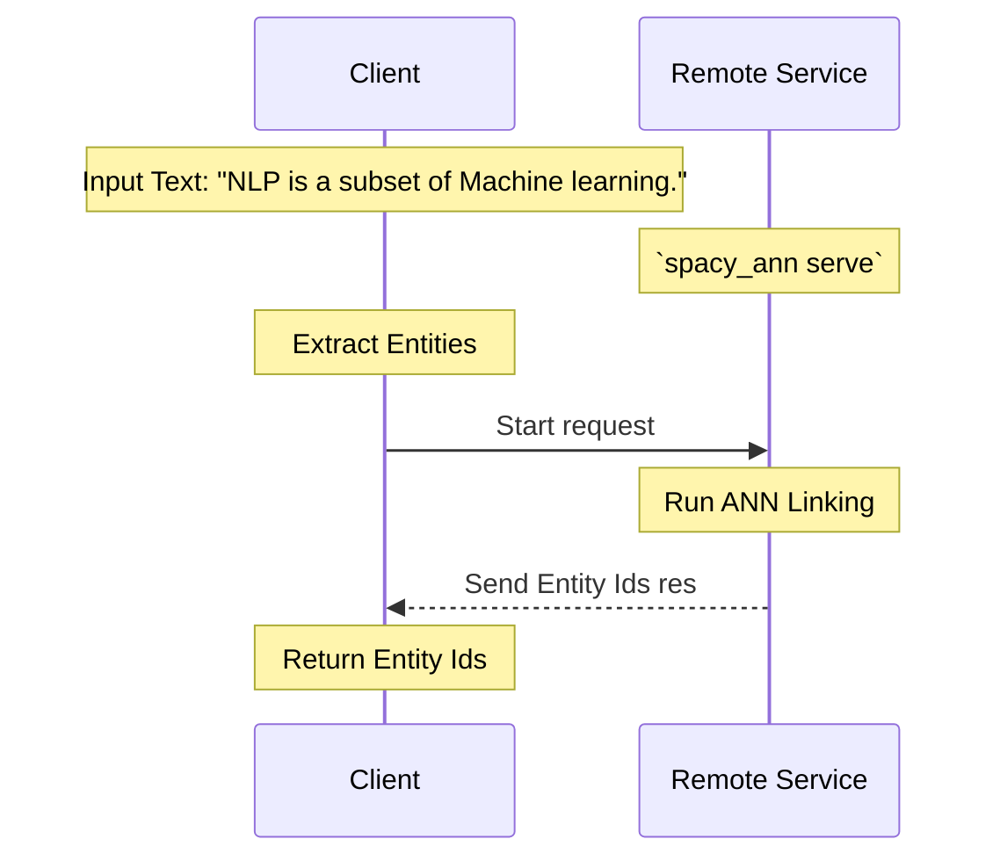

# Tutorial - Remote Entity Linking

## Introduction

The original reason for developing this package at Microsoft is we need a way to Link Entities to a KnowledgeBase without having that KnowledgeBase in memory. 

This tutorial walks through creating the ANN Index for all the Aliases in a KnowledgeBase remotely and exposing the index through a Web Service using the `spacy_ann serve` command


!!! tip 
    Internally, the API is built using FastAPI. If you're unfamiliar with FastAPI, you can read more about it here: [FastAPI](https://fastapi.tiangolo.com/)

!!! note
    This tutorial assumes you've already run the `create_index` command and have a saved model. If you haven't already done that, follow the steps in the [Introduction](../index.md)



## Prerequisite - Install [api] requirements

`spacy-ann-linker` provides an installation extension for using the `serve` CLI command called `[api]`
To install the api extension run:


<div class="termy">

```console
$ pip install spacy-ann-linker[api]
---> 100%
Successfully installed spacy-ann-linker[api]
```

</div>

Now you can run the `spacy_ann serve` command


## Serve a model remotely

In order to serve a model, you need to have already run the `create_index` command and have
as saved spaCy model with an `ann_linker` pipeline component.

If you have this already, you can serve that model using the `serve` command provided in the CLI.

For the example below I'm going to use the example ann_linker model we used in the tutorial.

<div class="termy">

```console
$ spacy_ann serve examples/tutorial/models/ann_linker
Started server process [21052]
Waiting for application startup.
Application startup complete.
Uvicorn running on http://127.0.0.1:8080 (Press CTRL+C to quit)
```

</div>

## Example Request

`spacy-ann-linker` provides an example JSON input request based on the model created with the example tutorial data. This is the request format that the default server accepts.

```json
{
    "documents": [
        {
            "spans": [
                {
                    "text": "NLP",
                    "start": 0,
                    "end": 3,
                    "label": "SKILL"
                },
                {
                    "text": "researched",
                    "start": 16,
                    "end": 26,
                    "label": "SKILL"
                },
                {
                    "text": "Machine learning",
                    "start": 37,
                    "end": 53,
                    "label": "SKILL"
                }
            ],
            "context": "NLP is a highly researched subset of Machine learning."
        }
    ]
}
```
From this request, you can see that we're passing the Entity Spans extracted by an NER model along with the context in which they were extracted. This is all the input data we need for the `ann_linker` component to be able to identify candidate aliases and disambiguate and alias to a cononical entity id.

If you open your browser to http://localhost:8080 now you'll be automatically redirected to the `/docs` route and greeted with the Open API UI for the Web Service


Now if you click on the green highlighted link route, click the button that says "Try it out" and hit Execute, you'll be making a request with the `example_request.json` data and should get a JSON reponse back that looks like:

```json
{
    "documents": [
        {
            "spans": [
                {
                    "text": "NLP",
                    "start": 0,
                    "end": 3,
                    "label": "SKILL",
                    "id": "a3"
                },
                {
                    "text": "researched",
                    "start": 16,
                    "end": 26,
                    "label": "SKILL",
                    "id": "a15"
                },
                {
                    "text": "Machine learning",
                    "start": 37,
                    "end": 53,
                    "label": "SKILL",
                    "id": "a1"
                }
            ],
            "context": "NLP is a highly researched subset of Machine learning."
        }
    ]
}
```

## Call the Web Service

Now that we have an understanding of the remote web service, we need an easy way to call this service from a normal spaCy pipeline. The `spacy_ann.remote_ann_linker.RemoteAnnLinker` component handles this interaction.

The following example code demonstrates the usage of the `RemoteAnnLinker`.

### Load Extraction Model

First, load a model capable of extracting the Entities in your KnowledgeBase. This could be a trained NER model or a rule based extraction or a combination of both. For simplicity we'll use the spaCy `EntityRuler` component and just add a few terms to it that are close to those in our KnowledgeBase.

```Python hl_lines="4 5 6 7 8"
{!./src/remote_ann_linker.py!}
```

### Create a `remote_ann_linker` pipe

Now create a `remote_ann_linker` pipe using `nlp.create_pipe` and set the `base_url` config value to the batch linking url of your web service. If you're testing the service locally from the last step this should be `http://localhost:8080/link`

```Python hl_lines="10 11 12 13"
{!./src/remote_ann_linker.py!}
```

### Run the pipeline

Now you can call the pipeline the exact same way as you did in when using the local `ann_linker` component and you should get the exact same results.

```Python hl_lines="15 16"
{!./src/remote_ann_linker.py!}
```

## Conclusion

This Web Service is quite simple for the tutorial. It skips over things like a health check url, Docker/Kubernetes based deployment, etc. It's merely meant as a quick guide to illustrate the problem this package was originally designed to solve.
